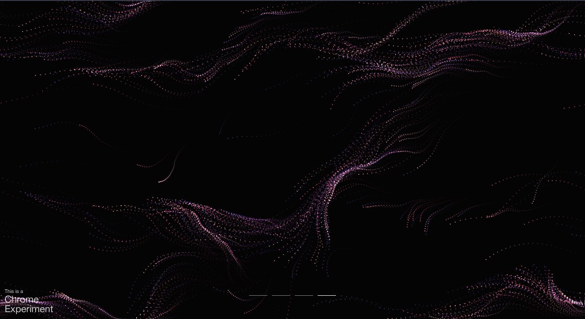
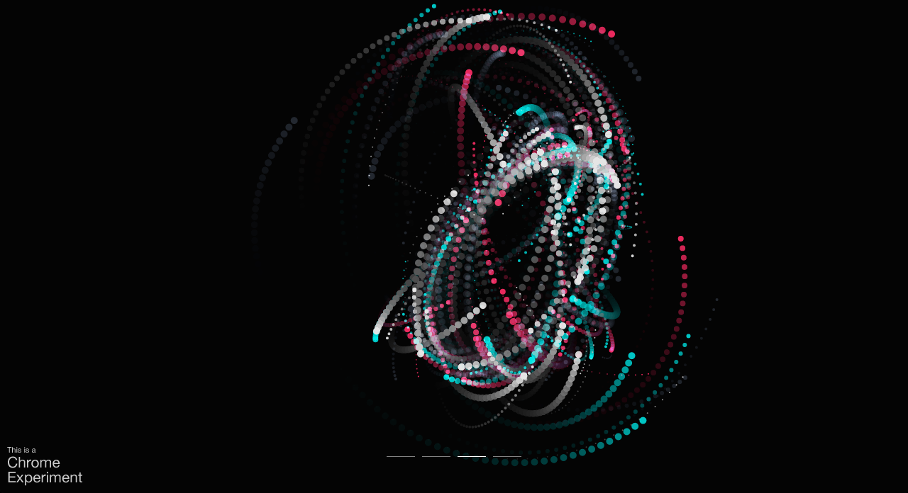

# Naturally Bizarre

* Project based on work of [lhbzr](https://github.com/bizarro/)
* Outdated - Experiments based in the series [The Nature of Code](http://natureofcode.com/) by [Daniel Shiffman](http://shiffman.net/).

  

  
  
  

  

  

